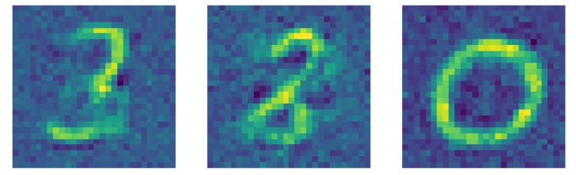

# MNIST Image Generator Using GANs

Generative adversarial networks (GANs) are an exciting recent innovation in machine learning. GANs are generative models: they create new data instances that resemble your training data. For example, GANs can create images that look like photographs of human faces, even though the faces do not belong to any real person. You can examine the GANs architecture below. In this repository, we create new images using the MNIST dataset.

**Note**: If you want to learn detailed information about the GANs architecture, you can follow the following link: https://developers.google.com/machine-learning/gan/gan_structure?hl=en

## Results

We defined a basic GANs model to predict images similar to images in the MNIST dataset. You can see outputs of the model below. Also you can see the code from the file of "mnist_generator.ipynb". For people who want to use the model for their specific tasks, they can download to the file of "mnist_generator.h5"

